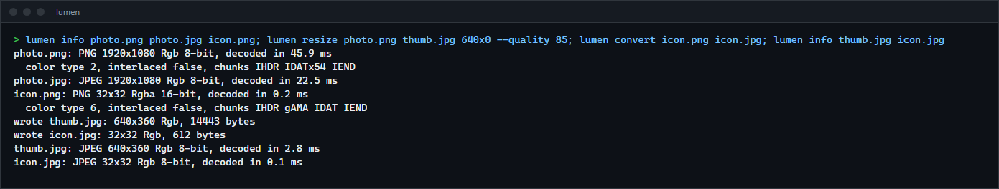

# lumen

PNG and baseline JPEG decoders and encoders, DEFLATE (inflate and deflate), resizing and colour conversion, written from scratch in Rust with no dependencies. A library plus a small command-line tool, for anyone who wants to see how image codecs work or needs a compact, dependency-free codec that is checked against the reference implementations.

**Status:** v0.1.0. Not published to crates.io.



## Features

| Part | What it does | Checked against |
|---|---|---|
| inflate | Stored, fixed and dynamic Huffman blocks, zlib wrapper with Adler-32, an output limit against decompression bombs | Python's zlib; every PngSuite file |
| deflate | LZ77 with hash chains and lazy matching (zlib's parameters per level 0 to 9), per block the smallest of stored, fixed or dynamic Huffman, length-limited codes | Round trips at every level |
| PNG decode | Every colour type and bit depth (1 to 16), Adam7 interlacing, palettes, tRNS transparency, CRC checks, size limits | All 162 valid PngSuite images match Pillow pixel for pixel (pypng where Pillow is wrong); all 14 broken ones are refused |
| PNG encode | 8 and 16 bits, every row filtered with the cheapest of the five filters | Every PngSuite image survives encode and decode unchanged |
| JPEG decode | Baseline and extended Huffman (SOF0, SOF1), any sampling factors, restart intervals, grayscale and YCbCr, libjpeg's fancy upsampling | Pillow (libjpeg-turbo) on 11 files: largest difference 3 levels in 255, mean at most 0.2 |
| JPEG encode | 4:2:0 or 4:4:4, libjpeg's quality scaling, optimized Huffman tables | Within 0.05 dB PSNR of libjpeg-turbo at the same quality, and 1 to 2 % smaller |
| Resize | Nearest, bilinear, bicubic, Lanczos3; filters widen when shrinking; premultiplied alpha | Pillow: byte-identical output for every filter and size tested |
| Colour | Gray, gray+alpha, RGB, RGBA, 8 and 16 bits; BT.601 luma | Unit tests |

Not supported: progressive and arithmetic-coded JPEG, CMYK JPEG, 12-bit JPEG (all refused with an "unsupported" error, never decoded wrongly), APNG, ICC profiles and EXIF orientation.

## How to install

Requires a recent stable Rust (built with 1.98.1).

```sh
git clone https://github.com/r3clusionn/image-library
cd image-library
cargo install --path .
```

As a library, add it as a git dependency:

```toml
[dependencies]
lumen = { git = "https://github.com/r3clusionn/image-library" }
```

## How to use

```sh
lumen info photo.png scan.jpg                 # size, colour layout, bit depth, PNG chunks, decode time
lumen convert photo.png photo.jpg --quality 85
lumen resize photo.jpg thumb.png 640x0 --filter lanczos3
```

| Option | What it does |
|---|---|
| `--quality N` | JPEG quality, 1 to 100 (default 90). |
| `--444` | JPEG without chroma subsampling (default 4:2:0). |
| `--level N` | PNG compression level, 0 to 9 (default 6). |
| `--filter F` | `nearest`, `bilinear`, `bicubic` or `lanczos3` (default). |
| `WxH` | Target size; a 0 keeps the aspect ratio. |

The output format comes from the extension. Images with alpha written as JPEG are composited over white.

From Rust:

```rust
use lumen::{jpeg, png, resize::{resize, Filter}};

let img = png::decode(&std::fs::read("in.png")?)?;
let small = resize(&img, 320, 240, Filter::Lanczos3);
std::fs::write("out.jpg", jpeg::encode(&small, jpeg::JpegOptions { quality: 85, ..Default::default() }))?;
```

## How it works

- **Inflate** decodes each Huffman code with one table lookup (a table as wide as the longest code). Back references copy as a block, or byte by byte when source and destination overlap (runs).
- **Deflate** keeps hash chains in a ring the size of two windows, compares candidate matches eight bytes at a time, and for each block of 64K tokens computes the exact size of stored, fixed and dynamic coding before choosing one. Huffman code lengths are limited to 15 (7 for the code-length code) by moving overlong codes up while keeping Kraft's inequality.
- **JPEG decode** uses a separable float IDCT, then libjpeg's "fancy" triangle upsampling for 2x chroma (with its alternating rounding), which is why the output stays within a few levels of libjpeg-turbo's rather than drifting at chroma edges.
- **Resize** follows Pillow's resampler exactly: weights in `f64`, normalised, converted to 22-bit fixed point, horizontal pass first, each pass rounded and clamped to 8 bits.
- **Tests** compare against other implementations rather than against itself: `scripts/make_references.py` (PngSuite with Pillow and pypng) and `scripts/make_jpeg_references.py` (JPEGs and resizes from Pillow) write the reference data in `tests/`.

## Benchmarks

`python scripts/bench.py`: a 1920x1080 RGB synthetic photo (gradients, a hard-edged disc, Gaussian noise), median of 15 runs (5 for PNG encode), one thread each. Pillow 12.3 calls zlib, libpng's filters and libjpeg-turbo (with SIMD). Intel Core i9-14900KF, Windows 11, Rust 1.98.1 release build.

| Operation | lumen | Pillow | lumen / Pillow |
|---|---:|---:|---:|
| PNG decode | 45.5 ms | 21.9 ms | 2.1x |
| PNG encode, level 6 | 324 ms | 132 ms | 2.5x |
| JPEG decode, 4:2:0 | 22.1 ms | 4.7 ms | 4.7x |
| JPEG encode, q90 4:2:0 | 29.7 ms | 8.7 ms | 3.4x |
| Lanczos3 to 960x540 | 29.9 ms | 16.5 ms | 1.8x |

Output sizes on the same image: PNG 3,531,584 bytes (Pillow 3,501,764), JPEG 221,767 bytes (Pillow 227,685).

lumen is portable scalar Rust: no SIMD, no unsafe code. Two fixes found while measuring: `f32::round` compiles to a library call on baseline x86-64, and replacing it in the IDCT and colour conversion took JPEG decoding from 112 ms to 22 ms; table lookups for DEFLATE length and distance symbols took PNG encoding from 398 ms to 324 ms.

## License

MIT (see `LICENSE`). The PngSuite test images are by Willem van Schaik and are free to redistribute (`tests/pngsuite/PngSuite.LICENSE`).
